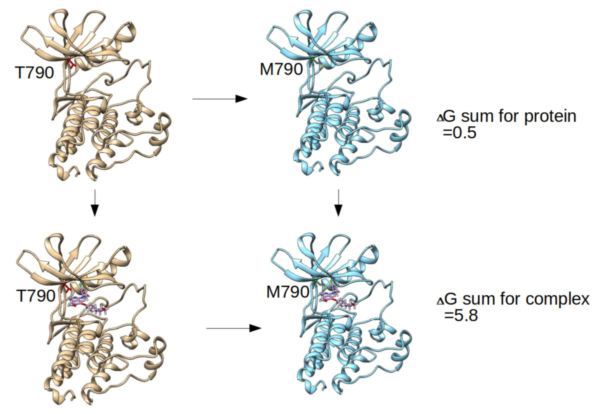

#  Protein Mutaion caused Drug Resistance

to analyze protein drug binding with Thermodynamic Integration (TI) simulations 

This is the script to run TI simulation with AMBER18 pmemd GPU version for side–chain mutations or more generally for transformations that involve covalent bonds to a transformed group. (modified from amber tutuorial "Small molecule binding to T4-lysozyme L99A")

I will investigate here what happens to binding to anti tumor drug Gefitinib in EGFR (PDB ID 181L) when wild EGFR was mutated T790 to M790, which happened in some patients after Gefitinib treatment for while. I hypothesize that mutating this residue to Methionine will have a destabilising effect due to steric clashes.

The analysis script suggests that the Threonine 790 is favoured over the Methionine mutant by about 5 kcal/mol.  

