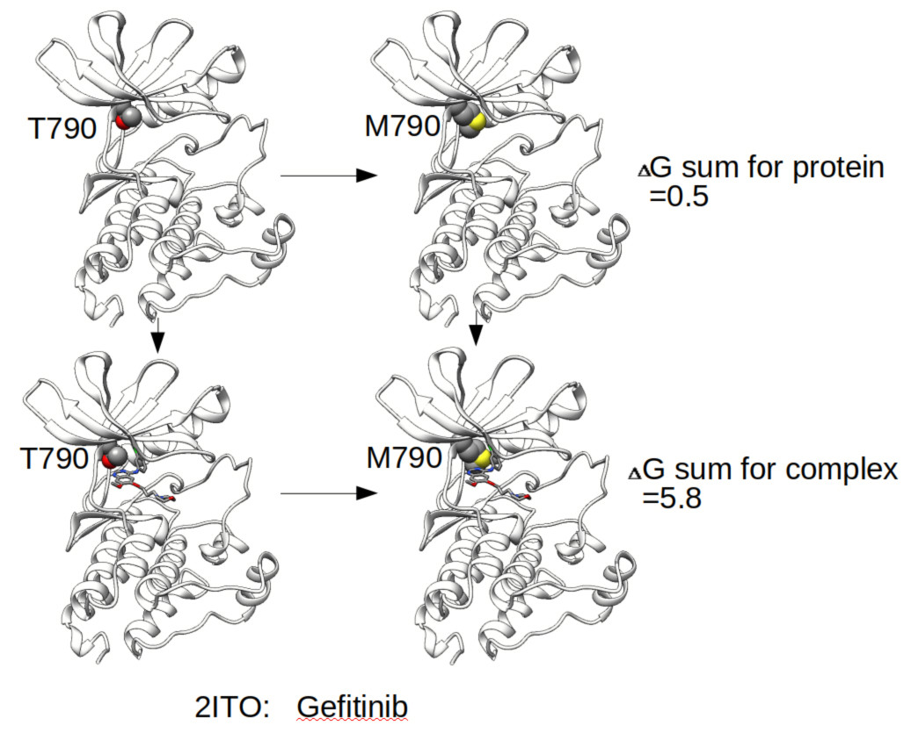
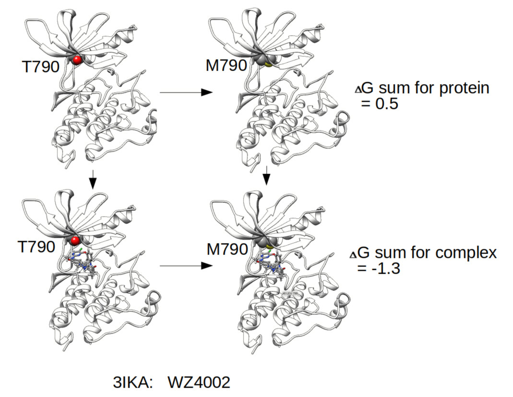

#  Protein site Mutant caused Drug Resistance

to analyze protein drug binding free energies with Thermodynamic Integration (TI) simulations 

This is the script to run TI simulation with AMBER18 pmemd GPU version (much faster relative to GPU version) for side–chain mutations or more generally for transformations that involve covalent bonds to a transformed group. (Modified from amber tutuorial "Small molecule binding to T4-lysozyme L99A")

I will investigate here what happens to binding to anti tumor drug Gefitinib and WZ4002 in EGFR (PDB ID 2ITO and 3IKA) when wild EGFR was mutated T790 to M790, which happened in some patients after Gefitinib treatment for while.  WZ4002 is an EGFR selective inhibitor targeting cancers which express the T790M mutation. The inhibitor suppresses inhibitor resistant cancer cell lines in vitro. 
I hypothesize that mutating this residue to Methionine will have a destabilising effect to Gefitinib but not WZ4002 due to steric clashes. 

The analysis script suggests that the Threonine 790 (T790) is favoured over the Methionine mutant (M790) by about 5 kcal/mol in EGFR-Gefitinib complex;  M790 mutant is favoured over T790 by about 2 kcal/mol in EGFR-WZ4002 complex. This calculation succussful explained why M790 mutant cell is resistant to Gefitinib but not drug WZ4002. TI simulation can predict the relative drug binding affinity between wild type and mutunt, it may be useful for personalized medicine. 

In drug development feild, TI simulation can be used to compute relative binding free energies, making them useful in drug design or lead optimization. 

#
#

#

#

